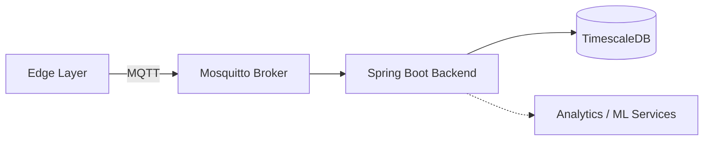

# Open-PMF (Open Predictive Maintenance Framework)

Open-PMF is an **open, cloud-agnostic framework for industrial predictive maintenance**, designed to model a *realistic end-to-end pipeline* from edge data acquisition to backend processing and analytics.

The goal of this project is **not** to deliver a closed, ready-made product, but to provide a **solid architectural foundation** that can be adapted to different industrial contexts, machines, and business needs.

---

## 🎯 Problem Statement

Industrial predictive maintenance is typically addressed in two unsatisfactory ways:

1. **Proprietary enterprise platforms** that are expensive, opaque, and impose vendor lock-in.
2. **Isolated proofs of concept** (scripts, notebooks, demos) that do not reflect real production environments.

Open-PMF aims to sit between these extremes by offering:

* a realistic industrial data pipeline,
* modular components that can be extended or replaced,
* and an architecture suitable for both learning and real-world pilots.

---

## ❓ Why This Project Exists

Most predictive maintenance initiatives fall into one of two categories:

* **Enterprise platforms** that are powerful but expensive, opaque, and tightly coupled to vendors.
* **Academic or hobbyist proofs of concept** that demonstrate algorithms, but ignore real-world system constraints such as ingestion, security, deployment, and scalability.

As a result, engineers often end up rebuilding the same infrastructure repeatedly: data ingestion, messaging, storage, and basic telemetry handling — before they can even start experimenting with analytics.

Open-PMF exists to **bridge this gap**.

It provides a **clean, realistic, end-to-end architectural baseline** that reflects how industrial predictive maintenance systems are actually built, while remaining open, inspectable, and adaptable.

The project prioritizes:

* architectural clarity over feature completeness,
* realistic data flow over toy examples,
* and long-term extensibility over short-term demos.

---

## 🔌 Design Philosophy: Pluggability Over Prescription

Open-PMF is intentionally designed to avoid locking users into any specific:

* hardware vendor,
* cloud provider,
* database technology,
* or machine learning framework.

Instead of prescribing *how* predictive maintenance must be implemented, the framework focuses on defining **clear system boundaries and contracts** between components.

This allows users to:

* run the stack fully on-premise or in the cloud,
* swap databases or messaging systems,
* and attach analytics or ML pipelines without modifying the core system.

Machine learning is treated as an **optional, external capability**, not a mandatory dependency.

---

## 🚧 Project Status

Open-PMF is an evolving, architecture-first framework.

The current implementation focuses on data ingestion, messaging, and storage to establish a realistic baseline for industrial telemetry systems. Advanced capabilities such as visualization, alerting, and machine learning are intentionally scoped as future extensions.

This approach allows the core architecture to remain stable while higher-level features evolve independently.

---
## 🏗️ Architecture Overview




1. **Edge Layer**

   * Python-based vibration data simulator
   * Supports normal operation and anomaly injection
   * Designed to mimic real sensor behavior

2. **Messaging Layer**

   * MQTT broker (Eclipse Mosquitto)
   * Authenticated communication
   * Decouples data producers from consumers

3. **Backend Layer**

   * Spring Boot application
   * Responsible for ingestion, validation, and persistence
   * Clear separation between transport and domain logic

4. **Storage Layer**

   * PostgreSQL / TimescaleDB
   * Optimized for time-series telemetry

All components are **containerized with Docker**, enabling reproducible deployments and easy experimentation.

---

## ✨ Key Design Principles

* **End-to-end realism** – reflects how industrial systems are actually built
* **Cloud-agnostic** – no dependency on a specific provider
* **Modularity** – components can be swapped or extended
* **Protocol decoupling** – hardware details are isolated from business logic
* **Education + Production mindset** – useful both for learning and pilots

---

## 📦 Current Features

* High-frequency vibration data simulation
* Anomaly generation for testing detection logic
* Secure MQTT-based ingestion
* Time-series storage using TimescaleDB
* Fully dockerized environment

---

## 🚧 Current Limitations

This project is **intentionally incomplete** and should be viewed as a foundation:

* No production-grade dashboards yet
* No built-in machine learning models
* Limited alerting and visualization
* Focused on vibration data only

These limitations are deliberate to keep the core architecture clean and extensible.

---

## 🛣️ Future Work

Potential directions for extension include:

* Pluggable anomaly detection modules (statistical and ML-based)
* Remaining Useful Life (RUL) estimation
* Grafana or custom dashboards
* OPC-UA and PLC integrations
* Edge-side inference
* Multi-tenant support

---

## 🎓 Intended Audience

* Software engineers interested in industrial systems
* IoT and platform engineers
* Students learning system architecture beyond CRUD applications
* Teams building predictive maintenance pilots

---

## ⚠️ Disclaimer

Open-PMF is **not a turnkey commercial solution**.

It is a **reference architecture and learning-oriented framework** meant to accelerate understanding and experimentation in industrial predictive maintenance.

---

## 📜 License

MIT License

---

## 🤝 Contributing

Contributions, discussions, and architectural feedback are welcome.

The project favors **clarity and correctness over feature count**.

---

## 🚫 Non-Goals (At This Stage)

To keep the project focused and realistic, Open-PMF deliberately does **not** aim to:

* Provide built-in machine learning models
* Enforce a specific cloud provider or deployment model
* Depend on specialized hardware or proprietary sensors
* Act as a turnkey predictive maintenance product

These constraints are intentional. The goal is to provide a **neutral, extensible foundation**, not a vertically integrated platform.

---

## 🔮 Extensibility & Future Work

Open-PMF is designed so that advanced capabilities can be added **without changing the core ingestion pipeline**.

Possible extensions include:

* External ML services (Python, FastAPI, gRPC, etc.)
* Feature extraction pipelines
* Streaming platforms (Kafka, Redpanda, Pulsar)
* Alternative time-series or analytical databases
* Visualization and alerting layers
* Edge or near-edge inference

Because all components communicate through well-defined interfaces, these additions can evolve independently.

---

## ⚠️ Known Limitations

This project is intentionally scoped as an architectural proof of concept. As such, several aspects required for full production readiness are either simplified or omitted:

* Limited observability (no metrics, tracing, or centralized logging)
* No formal schema registry or strict message versioning
* Simplified security model (basic broker authentication, no RBAC)
* No explicit tenant isolation mechanisms
* No load or fault-injection testing at scale

These limitations are acknowledged by design and represent natural areas for future iteration.

---

## 🚀 Quick Start

The fastest way to get the stack running locally:

```bash
cp .env.example .env
docker-compose up -d
```

This will start all core services and allow you to observe the full telemetry ingestion flow end to end.
